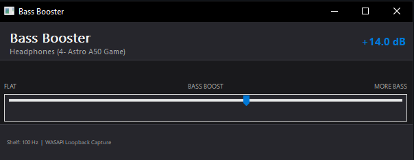
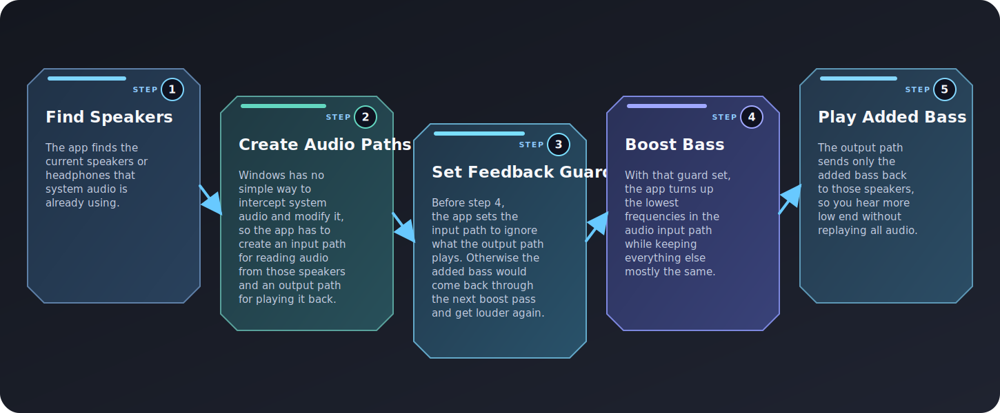

# Win32 Bass Booster

[![Build][build-badge]][build-workflow] [![Coverage][cov-badge]][cov-report]

A simple, system-wide bass boost application for Windows.



# How to use

If you just want to use the app, download the latest
`Win32BassBooster.exe` from [Releases][github-releases] and run it. No
archive extraction is required.

Then drag the slider to choose how much bass boost you want. The window footer
shows the current default render device name when startup succeeds.

# How to build

## Prerequisites

- **Windows 10 or later**
- **Visual Studio 2022** (Community, Professional, or Enterprise) with the
  **Desktop development with C++** workload, or the free [Build Tools for Visual
  Studio 2022][vs2022-build-tools] with the same workload selected
- **CMake 3.16+** -- included with Visual Studio 2022 and also available
  standalone from [cmake.org][cmake-download]

Optional but strongly recommended:

- **LLVM** with `clang-format` and `clang-tidy` on `PATH`

All commands below should be run from a **Developer Command Prompt for VS
2022**, or any terminal where `cmake` and the MSVC toolchain are already on
`PATH`.

## Building and testing

```bat
cmake -B build
cmake --build build --config Release
ctest --test-dir build -C Release --output-on-failure
```

The built executable is written to `build\bin\Release\Win32BassBooster.exe`.

### Debug build

```bat
cmake -B build
cmake --build build --config Debug
ctest --test-dir build -C Debug --output-on-failure
```

Debug output lands in `build\bin\Debug\Win32BassBooster.exe`.

### Running the tests only

```bat
ctest --test-dir build -C Release --output-on-failure
```

Google Test and Google Mock are fetched automatically by CMake on first
configure.

### Reconfiguring from scratch

If you switch toolchains or hit a stale cache, delete the build directory and
re-run configure:

```bat
rmdir /s /q build
cmake -B build
cmake --build build --config Release
```

## Building with VS Code

### Extensions

Install these two extensions from the VS Code Marketplace:

- [C/C++][vscode-cpptools] (ms-vscode.cpptools) -- IntelliSense and debugging
- [CMake Tools][vscode-cmake-tools] (ms-vscode.cmake-tools) -- configure,
  build, and test without leaving the editor

### Open the project

Use **File -> Open Folder** and select the `Win32BassBooster` directory. CMake
Tools will detect `CMakePresets.json` and offer to configure automatically.

### Select a configure preset

The project uses **CMake presets** instead of kit selection. When prompted, or
via **Ctrl+Shift+P -> CMake: Select Configure Preset**, choose:

```text
Visual Studio 2022 x64
```

This selects the Visual Studio 2022 generator with x64 architecture and enables
both the GUI and test targets.

### Select a build preset

Open **Ctrl+Shift+P -> CMake: Select Build Preset** and choose **release** or
**debug**.

### Build

Press **F7**, click the **Build** button in the status bar, or run:

```text
Ctrl+Shift+P -> CMake: Build
```

The executable is written to `build\bin\Release\Win32BassBooster.exe` or
`build\bin\Debug\Win32BassBooster.exe`.

### Troubleshooting: platform mismatch

If you see an error like `"generator platform: x64 does not match the platform
used previously"`, delete the stale CMake cache and reconfigure:

```bat
rmdir /s /q build\CMakeCache.txt build\CMakeFiles
```

Then reopen the folder or run **Ctrl+Shift+P -> CMake: Configure**.

### Run the tests

Open the **Testing** panel (beaker icon in the Activity Bar) to run and inspect
individual tests, or run all tests at once:

```text
Ctrl+Shift+P -> CMake: Run Tests
```

### Run or debug the application

Use the status bar **launch target** selector to pick **Win32BassBooster**,
then:

- **Ctrl+Shift+P -> CMake: Run Without Debugging** -- launch the built exe
- **Ctrl+Shift+P -> CMake: Debug** -- launch under the debugger with
  breakpoints

## Project layout

```text
.
|-- src/
|   |-- bass_boost_filter.hpp/.cpp            # Biquad low-shelf bass boost
|   |-- endpoint_audio_format.hpp/.cpp
|   |   # Endpoint PCM decode to stereo float
|   |-- audio_pipeline_interface.hpp          # Abstract audio pipeline contract
|   |-- loopback_capture_activation.hpp/.cpp
|   |   # Process-loopback capture activation
|   |-- audio_pipeline.hpp/.cpp
|   |   # Startup, recovery, and bass-delta render path
|   |-- theme_manager.hpp/.cpp
|   |   # Dark/light palette + title bar theming
|   |-- main_window.hpp/.cpp
|   |   # Themed Win32 window and slider UI
|   |-- main.cpp                              # Entry point
|   `-- *_test.cpp                            # Unit tests (one per module)
|-- resources/
|   `-- app.rc                                # Manifest and version info
|-- .github/
|   `-- workflows/build.yml
|       # CI: release (clang-tidy) + debug (ASan, coverage)
|-- .githooks/
|   `-- pre-commit
|       # Auto-formats staged files on commit
|-- .clang-format                             # Code style configuration
|-- .clang-tidy                               # Static analysis configuration
|-- bass-booster-architecture.svg             # README high-level system diagram
|-- bass-booster-screenshot.png               # README application screenshot
|-- CMakePresets.json                         # Configure/build/test presets
|-- LICENSE
|   # License terms for this repository
`-- CMakeLists.txt
```

## Code style

The project uses two LLVM tools to keep code clean:

- `clang-format` -- auto-formats sources to Google C++ style; see
  `.clang-format` at the project root.
- `clang-tidy` -- static analysis at build time; see `.clang-tidy` at the
  project root.

[`CLAUDE.md`](CLAUDE.md) contains additional local code style and workflow
overrides specific to this repository. Refer to it for repo-specific formatting
and contribution rules.

Both tools are expected for normal contributions. CMake prints a warning during
configure if either tool is missing, and CI enforces them on push and pull
request builds.

### Installing LLVM on Windows

1. Go to the [LLVM releases page][llvm-releases] and download the Windows
   installer.
2. Run the installer and add LLVM to `PATH`.
3. Open a new terminal and verify:

   ```bat
   clang-format --version
   clang-tidy --version
   ```

4. Re-run CMake configure so it picks up the tools:

   ```bat
   cmake -B build
   ```

### Registering the pre-commit hook

`cmake -B build` registers `.githooks` as the local git hooks directory
automatically. After that, every `git commit` auto-formats staged `.cpp` and
`.hpp` files with `clang-format` before the commit is recorded.

If `clang-format` is not on `PATH`, the hook prints a warning and proceeds, so
you can still commit locally, but this may result in CI failures due to
formatting issues and require additional commits to fix style problems.

### Formatting all sources manually

```bat
cmake --build build --target format
```

### Disabling clang-tidy locally

If you need to build without clang-tidy for a quick local iteration, pass:

```bat
cmake -B build -DENABLE_CLANG_TIDY=OFF
```

Do not land code built this way without running the normal checks again.

## CI and branch protection

GitHub Actions runs two parallel jobs on every push and pull request:

- **release** -- builds with clang-tidy (`-warnings-as-errors=*`) and runs
  tests in Release mode.
- **debug** -- builds with AddressSanitizer (`/fsanitize=address`), runs tests
  in Debug mode under OpenCppCoverage, and generates an HTML coverage report
  and badge.

The badge above reflects the current status of `main`. Pushes to `main` publish
the HTML report and coverage badge through GitHub Pages.

To prevent merging broken code, enable branch protection in the GitHub
repository settings:

1. **Settings -> Branches -> Add branch protection rule** for `main`
2. Enable **Require status checks to pass before merging** and select both the
   `release` and `debug` checks
3. Enable **Require branches to be up to date before merging**
4. Enable **Do not allow bypassing the above settings**

With these rules in place, no PR can be merged and no direct push to `main` can
succeed unless both CI jobs and all tests pass.

## How it works



### Step 1 -- Find speakers

The pipeline finds the current default render endpoint -- Windows' name for
whichever speakers or headphones are currently selected as the output device.
[`audio_pipeline.cpp`](src/audio_pipeline.cpp) opens the endpoint in shared mode
(meaning other apps can keep using the same device at the same time) and asks
Windows for the device's mix format -- the sample rate, bit depth, and
channel layout the device is already using. The app requires that format to be
float32 stereo (two channels of 32-bit floating-point samples stored
back-to-back). Float32 is the simplest format to do math on because the samples
are already ordinary decimal numbers (like 0.5 or -0.3) rather than raw integers
that need scaling, and stereo (left + right) is what virtually all desktop
desktop speakers and headphones use.

### Step 2 -- Create audio paths

Windows has no built-in way to intercept and modify system audio in-flight, so
the app creates two separate audio paths on the endpoint found in step 1:

- **Input (capture) path** -- reads a copy of the audio that is already on its
  way to the speakers. This uses Windows process loopback through
  `ActivateAudioInterfaceAsync`, wrapped in
  [`loopback_capture_activation.cpp`](src/loopback_capture_activation.cpp).
- **Output (render) path** -- plays processed audio back to the same speakers.

The capture path uses whatever format the render endpoint uses, so the pipeline
reuses the same mix format for both paths.

Both paths run on a dedicated high-priority thread using
`AvSetMmThreadCharacteristicsW("Pro Audio", ...)`. If a Windows audio API call
on either path fails, the audio thread tries to reacquire the default render
endpoint and reopen both paths before giving up.

### Step 3 -- Set feedback guard

The activation path in
[`loopback_capture_activation.cpp`](src/loopback_capture_activation.cpp)
excludes this process tree from capture. Without that guard, the extra bass
rendered in step 5 would appear in the capture path the next time it reads
audio, get boosted again, and grow louder each cycle until the output clips
(distorts because the signal exceeds the maximum level the device can
reproduce).

### Step 4 -- Boost bass

Each captured packet goes through these stages:

1. [`endpoint_audio_format`](src/endpoint_audio_format.cpp) decodes the
   endpoint packet to interleaved stereo float samples -- left and right channel
   values stored in alternating order (`L, R, L, R, ...`), where each value is a
   decimal number (like 0.5 or -0.3) representing the air pressure at that
   instant.
2. [`bass_boost_filter`](src/bass_boost_filter.cpp) applies a low-shelf biquad
   filter. A shelf filter raises or lowers everything below a chosen frequency
   (here, 100 Hz) by a fixed amount, while leaving higher frequencies mostly
   unchanged -- think of it as a volume knob that only affects the bass. "Low-
   shelf" means the boost applies to the low end. 100 Hz is where the filter
   transitions from boosted to unboosted; frequencies well below 100 Hz get the
   full boost, frequencies well above are untouched, and frequencies near 100 Hz
   see a gradual rolloff.

A biquad is a second-order IIR (infinite impulse response) filter derived here
from the [Audio EQ Cookbook](https://www.w3.org/TR/audio-eq-cookbook/) low-shelf
formula. "Second-order" means the filter looks back two samples into its own
history to decide each new output value, giving it a smooth transition between
the boosted and unboosted frequency ranges. The difference equation is:

```text
y[n] = b0 * x[n] + b1 * x[n - 1] + b2 * x[n - 2]
                  - a1 * y[n - 1] - a2 * y[n - 2]
```

Five coefficients (`b0`, `b1`, `b2`, `a1`, `a2`) describe the filter. The filter
also stores the last two input and output values for each channel (left and
right). These stored values let the filter "remember" where it left off, so when
Windows hands the app a new packet of audio the filter continues smoothly
from the previous packet. Without them, each packet would start from silence and
you would hear a click or pop at every packet boundary.

All frequencies below 100 Hz are boosted by the chosen gain (measured in
decibels -- a logarithmic loudness scale where +6 dB roughly doubles the
perceived level). Frequencies above 100 Hz stay close to the original signal.
The filter uses a Butterworth Q of 0.707, which produces the flattest possible
response in the boosted region -- no peaks or dips, just a smooth level
increase.

**Slider mapping.** The slider in [`main_window.cpp`](src/main_window.cpp) maps
position `p` in `[0, 1]` to gain via a square-root curve:

```cpp
gain_db = kMaxGainDb * sqrt(p);  // p=0 -> 0 dB, p=1 -> 18 dB
```

The square-root curve bends upward quickly and then flattens out, so the
midpoint of the slider already produces about 70.7% of the maximum gain. That
makes the boost audible early in the slider travel instead of bunching all the
change near the end.

`SetBoostLevel` is called from the UI thread while the audio thread is running.
The user-controlled DSP parameters are stored in atomics, so the audio thread
can read them without taking locks on the hot path (the time-critical inner loop
that processes every audio sample).

### Step 5 -- Play added bass

[`audio_pipeline.cpp`](src/audio_pipeline.cpp) subtracts the original samples
from the filtered samples and renders only the difference (`filter(signal) -
signal`) through the output path. Because the low-shelf filter leaves mids and
highs close to the original signal, the difference
contains only the extra bass energy the filter introduced.

If the app played the full filtered signal instead -- which already contains the
original mids, highs, and everything else -- you would hear a second, slightly
delayed copy of all system audio layered on top of the original. That
delay causes comb filtering: certain frequencies cancel out and others
reinforce, producing a hollow, metallic sound (like talking into a tube). By
rendering only the difference, the app adds bass without replaying a duplicate
of everything else the system is already playing.

### FAQ

**Why not write a device driver to intercept audio directly?**

A kernel-mode audio driver would let the app sit between applications and the
speakers, modifying audio before it reaches the hardware. However, Windows
requires kernel drivers to be signed with a special Extended Validation (EV)
certificate (which costs hundreds of dollars per year), and a bug in a kernel
driver can crash the entire system with a blue screen. The WASAPI loopback
approach used here runs entirely in user space: no special certificates, no
admin privileges, and a bug can only crash the app itself -- not the OS.

**Doesn't playing bass through the output path mean you hear it twice -- once
from the original audio and again from the app?**

No. The original audio is already playing through the speakers from whatever app
produced it (a music player, a game, etc.). Step 5 renders only the *difference*
between the filtered signal and the original -- that is, only the
extra bass energy the shelf filter added. The mids, highs, and original bass
level are subtracted out, so the output path carries just the added boost.
You hear the original audio once (from the source app) plus the extra bass (from
this app), not two copies of everything.

## License

See [LICENSE](LICENSE) for the license terms for this repository.

[build-badge]:
https://github.com/e7ite/Win32BassBooster/actions/workflows/build.yml/badge.svg
[build-workflow]:
https://github.com/e7ite/Win32BassBooster/actions/workflows/build.yml
[cov-badge]:
https://e7ite.github.io/Win32BassBooster/coverage-badge.svg
[cov-report]:
https://e7ite.github.io/Win32BassBooster/html/index.html
[github-releases]: https://github.com/e7ite/Win32BassBooster/releases
[vs2022-build-tools]: https://aka.ms/vs/17/release/vs_BuildTools.exe
[cmake-download]: https://cmake.org/download/
[vscode-cpptools]:
https://marketplace.visualstudio.com/items?itemName=ms-vscode.cpptools
[vscode-cmake-tools]:
https://marketplace.visualstudio.com/items?itemName=ms-vscode.cmake-tools
[llvm-releases]: https://github.com/llvm/llvm-project/releases/latest
